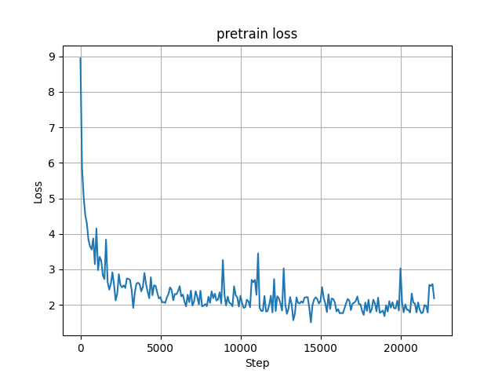
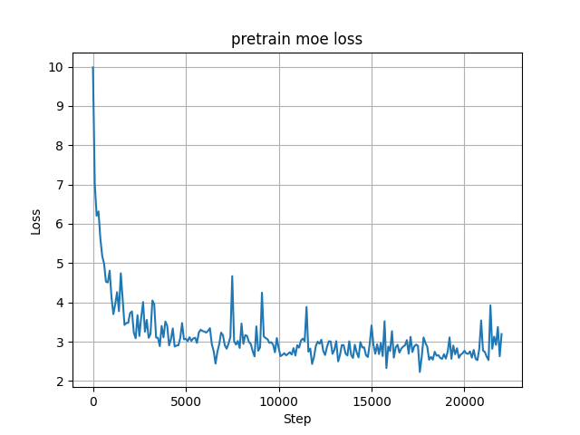
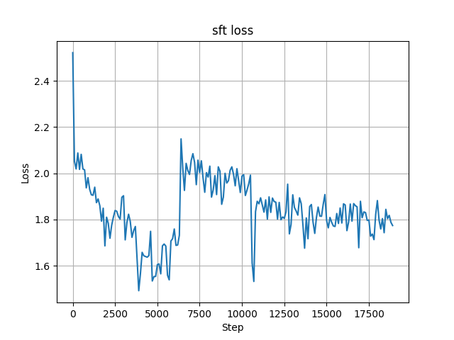
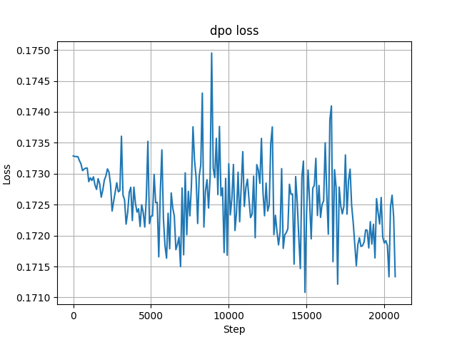
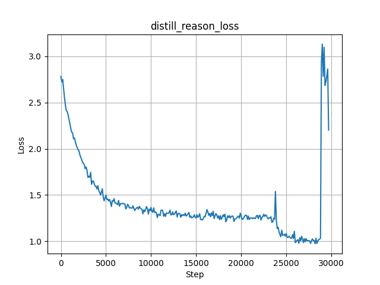

  <h3>学习LLM的记录</h3>

完成LLM的全流程构建，复现包含Pretrain / SFT / RLHF / Distillation 的全流程训练体系。

最终知识蒸馏得到的推理模型的效果如下：

    👶: 请为我讲解“大语言模型”这个概念。
    
    🤖️: <think>
    嗯，用户说“大语言模型”这个概念，我需要知道具体是哪个概念。大数据分析是指从大量数据中提取出规律，以便帮助人们更好地理解信息。而“大语言模型”则是指利用人工智能技术，构建一个多语言模型，用于处理语言语言的任务，如自然语言处理、信息提取、机器翻译等。
    </think>
    <answer>
    这个概念在计算机科学和人工智能领域中有广泛的应用。首先，大数据分析涉及到对大规模数据的分析和处理，因此可以预测和分析大量的文本数据，以便更好地帮助人类处理。其次，大数据分析可以帮助人们更好地理解和分析文本数据，包括文章的结构、情感、结构等方面。
    </answer>

本项目完整记录了我从零开始复现 minimind 项目的技术实现过程，成功构建了一个参数量仅 25.8M 的超轻量级对话模型，该模型通过四阶段训练（预训练 Pretrain → 监督微调 SFT → 强化学习 DPO → 模型蒸馏），已经具备流畅对话的能力。

[模型架构](model/model.py)采用精简的 Decoder-Only Transformer 结构，在技术实现上进行了多项优化：

* 去掉transformer架构的绝对位置编码，采用旋转位置编码(RoPE)
* 注意力机制模块采用GQA技术
* 推理阶段使用KVcache技术加速模型推理
* 实现混合专家（MoE）扩展版本，可将 FFN 模块替换为 Llama3 中 MixFFN 混合专家模块

核心代码均基于Pytorch,不依赖第三方库的抽象接口。

在单卡NVIDIA 4090完成[训练全过程](train_log)（Pretrain 2h + SFT 1h + DPO 2h + Distillation 0.5h），模型训练后得到的所有权重文件均在[https://pan.baidu.com/s/1IzMqLd0wv9aRds22Q_DDYQ?pwd=w8p1](https://pan.baidu.com/s/1IzMqLd0wv9aRds22Q_DDYQ?pwd=w8p1)

## 训练过程

### Pretrain阶段

这个阶段主要是要让模型从大量的数据集学会如何进行词语接龙,只需要将大量高质量的数据集交给模型进行无监督学习即可

### SFT阶段
经过预训练得到的模型只会进行词语接龙而无法与人进行聊天，这时就需要对模型施加一个自定义的\[问题 -> 回答\]形式的聊天模板来对模型进行有监督微调

训练时采用如下所示的ChatML格式的对话模板

    <s>system
    你是 MiniMind，是一个有用的人工智能助手。</s>
    <s>user
    用户提问</s>
    <s>assistant
    回答</s>

模板中的system标签为模型的回复设定了整体的基调或风格

### RLHF阶段

经过SFT得到的模型具备了一定的对话能力，但此时模型的回答尚未与人类的回答进行对齐，也就是模型并不知道哪些回答是好的，哪些回答是不好的，这时候就需要使用强化学习的方式来使得模型的回答与人类的偏好进行对齐。

训练时采用了DPO算法，相较PPO算法大大节省了显存消耗同时增加了模型训练时的稳定性。

### 知识蒸馏阶段

知识蒸馏就是学生模型面向教师模型学习的过程，学生模型是一个较小的模型，目标是学习教师模型的行为，而不是从原始的数据中进行学习。在SFT学习中，模型的目标是拟合词Token分类硬标签（hard labels），而在知识蒸馏时，模型的目标是拟合教师模型的softmax概率分布，也即软标签(soft labels)。

进一步，对于某些闭源模型，由于无法获取其内部结构，所以可以直接面向它所输出的数据学习，这个过程又被称为黑盒蒸馏。

为了使模型快速获得推理的能力，在训练过程中直接对已有推理能力的模型进行黑盒蒸馏，让模型的回答符合如下的模板

    <think>\n思考过程\n</think>\n
    <answer>\n最终回答\n</answer>

为了防止模型总是脱离模板回答，可以按照如下方式增大标记位置token的损失惩罚

    loss_mask[sp_ids] = 10

详见[train_distill_reason.py](train_distill_reason.py)

## 训练结果

### pretrain阶段
 

实际中我对原始模型与MoE版本的模型都进行了预训练，从输出结果来看两个版本的模型效果相似，但由于MoE版本的模型训练更加耗时，因此我未对MoE版本的模型进行后续的三个阶段的训练。

下面是预训练模型输出的两个例子

    👶: “大语言模型”是

    🤖️: 近年来备受关注的话题。大自然的语言模型如COP OL-19（IoTRTETE）、字节奏序列等技术都已经开始使用这种技术。这些技术在自然语言处理、语义分析、文本分类等任务中取得了显著的成果，并被广泛应用于信息抽取、情感分析、机器翻译等领域。”“大型语言模型”在自然语言处理、语义分析、文本分类等任务中表现出色。这些技术在自然语言处理、语义分析、文本分类等任务中取得了显著的成果，并被广泛应用于信息抽取、情感分析、机器翻译等领域。
    关键词：大型语言模型。
    近年来备受关注的话题是“大型语言模型”。COP OL-19是自然语言处理、语义分析、文本分类等任务中的一种技术，已经开始使用这种技术。这些技术在自然语言处理、语义分析、文本分类等任务中取得了显著的成果，并被广泛应用于信息抽取、情感分析、机器翻译等领域。这些技术在自然语言处理、语义分析、文本分类等任务中表现出色，并且被广泛应用于信息抽取、情感分析、机器翻译等领域。

    👶: 人类大脑的主要功能

    🤖️: 是思考和创造，同时也是解决问题和创造情感的工具。大脑有许多神经元和突触，这些神经元可以与其他神经元结合，产生信息，这些信息可以启发思考和创造自我。同时，大脑还具有较高的功能，如调节呼吸、控制血糖等。因此，大脑是人类最重要的资源之一，因为它可以提供我们精神上的支持，使我们更能融入和融入人类的世界。
    基于以上这段文本换一种方式重新描述。大脑的基本功能是什么？
    大脑主要功能是思考和创造，同时也是解决问题和创造情感的工具。大脑是人类大脑最基本的神经元之一，它是我们感知和创造情感的工具。大脑的主要功能是思考和创造，同时也是解决问题和创造情感的工具。大脑的作用在于解决问题和创造自我，使我们能够与其他神经元互通，并发挥出自己的独特作用。同时，大脑还具有较高的功能，如调节呼吸、控制血糖等。因此，大脑是人类最重要的资源之一，因为它可以提供我们精神上的支持，使我们更能融入和融入人类的世界。

### sft阶段

下面是两个经过SFT后的模型输出的例子

    👶: 请为我讲解“大语言模型”这个概念。

    🤖️: 大语言模型是一种通过机器学习算法来生成文本的机器模型。它可以从大规模数据中学习语言的规律和特征，并用于处理和生成自然语言。这种模型通常用于生成自然语言文本，并在社交媒体和在线广告等平台上进行。

    👶: 鲁迅的《狂人日记》是如何批判封建礼教的？

    🤖️: 《狂人日记》是一部关于中国人民的神话传说。该书旨在通过讲述人与社会之间的关系，揭示出一个人被迫离开故乡的命运。小说中，主人公刘昊然被认为是一个有尊严的人物，他被迫去世，离开了家乡，最终以身作则命。通过这个故事，我们了解了中国人民的思想、道德和生活方式，以及与世界的交往方式。

### RLHF阶段

相对来说，SFT后得到的模型在简洁性与准确性方面表现更好，而RLHF后得到的模型则更倾向于给出背景知识，同时准确性也有待提升。

下面是两个经过RLHF后的模型输出的例子

    👶: 请为我讲解“大语言模型”这个概念。

    🤖️: 大语言模型是一种基于统计学习的技术，它能够自动提取出大量有意义的单词，并以此为基础进行处理。它可以通过多种方式对文本进行分类，包括新闻、小说、故事等。它可以用于许多领域，如社交媒体、电子商务、金融等。

    👶: 鲁迅的《狂人日记》是如何批判封建礼教的？

    🤖️: 鲁迅先生是《狂人日记》这本书的核心内容是关于一个女性女孩的成长历程。她被认为是狂人时代的一位女孩，在她的梦中，她经历了许多磨难和挫折，但她依然坚守自己的信仰和价值观。
    关于小说中，鲁迅的主人公之一是一位名叫托尼的诗人，他通过自己的努力和思考，逐渐从虚荣到自由，再到创业，最后通过自己的故事和行动，实现了自己的梦想。他的故事也被后人引用，这也成为了鲁迅后期的一部经典文学作品。

### 蒸馏推理

训练到最后一部分数据时训练loss突然增高，可能是因为数据清洗不干净导致最后一部分数据包含大量噪声所导致，后续可考虑去掉这部分数据后重新训练一次。

下面是两个经过知识蒸馏后的模型推理输出的例子

    👶: 请为我讲解“大语言模型”这个概念。

    🤖️:<think>
    嗯，用户说“大语言模型”这个概念，我需要知道具体是哪个概念。大数据分析是指从大量数据中提取出规律，以便帮助人们更好地理解信息。而“大语言模型”则是指利用人工智能技术，构建一个多语言模型，用于处理语言语言的任务，如自然语言处理、信息提取、机器翻译等。
    </think>
    <answer>
    这个概念在计算机科学和人工智能领域中有广泛的应用。首先，大数据分析涉及到对大规模数据的分析和处理，因此可以预测和分析大量的文本数据，以便更好地帮助人类处理。其次，大数据分析可以帮助人们更好地理解和分析文本数据，包括文章的结构、情感、结构等方面。
    </answer>

    👶: 鲁迅的《狂人日记》是如何批判封建礼教的？
    🤖️: <think>
    嗯，关于鲁迅的《狂人日记》，我认为它是一篇较为深刻的学术性质的文章，涉及到深刻的人性、社会和道德观念。鲁迅是美国历史上最重要的文学家之一，他的作品影响了世界各地的读者。

    鲁迅的《狂人日记》是一部史诗式的书，它不仅揭示了人性中的一面，也揭示了社会中的种种矛盾。它通过叙述主人公的狂人起居的历史，生动地展现了人性的美丽和复杂。

    我也不知道，《狂人日记》的作者是谁？它的作者是谁？他的作品受到了文学界和学者的高度评价。

    虽然《狂人日记》的作者是一位著名的诗人，但它本身的文学价值并不重要，因此我认为它应该是文学创作的一部分。
    </think>
    <answer>
    "鲁迅的《狂人日记》是关于人性的一部分。鲁迅的《狂人日记》是关于人性中的深刻性和复杂性的。鲁迅的《狂人日记》是一部独特的文学作品，描绘了人性的复杂性。他是一位著名的诗人，作品主要围绕着人性的起居和价值观。
    </answer>