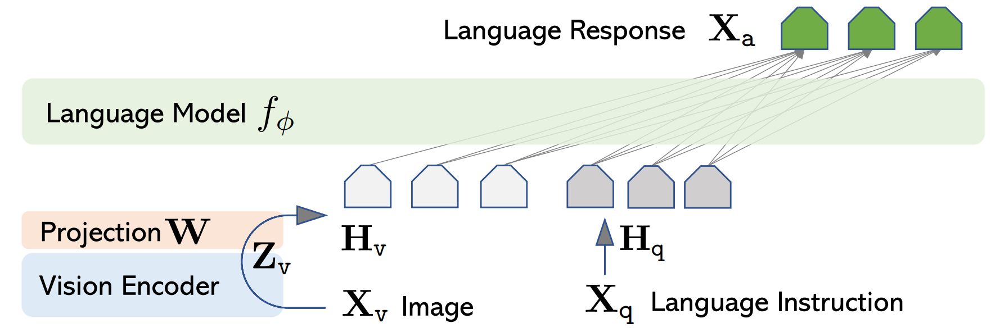

最终得到的视觉模型的效果如下

<table>
  <thead>
    <tr>
      <th>图片</th>
      <th>Pretrain_vlm</th>
      <th>SFT_vlm</th>
    </tr>
  </thead>
  <tbody>
    <tr>
      <td>
        
        &nbsp;&nbsp;&nbsp;&nbsp;&nbsp;&nbsp;&nbsp;&nbsp;&nbsp;&nbsp;&nbsp;&nbsp;&nbsp;&nbsp;&nbsp;&nbsp;&nbsp;&nbsp;&nbsp;&nbsp;&nbsp;&nbsp;&nbsp;&nbsp;&nbsp;&nbsp;&nbsp;&nbsp;
      </td>
      <td>在日落期间,美丽的云层和海景</td>
      <td>这幅图像的特点是一座大型海滩，位于一座高山上。这座大岛似乎是海岸线上一个明亮的天空，为它提供了一个美丽的背景。在画面中可以看到一座巨大的金色沙滩，为这个海滩增添了色彩和魅力。</td>
    </tr>
    <tr>
      <td>
        
        &nbsp;&nbsp;&nbsp;&nbsp;&nbsp;&nbsp;&nbsp;&nbsp;&nbsp;&nbsp;&nbsp;&nbsp;&nbsp;&nbsp;&nbsp;&nbsp;&nbsp;&nbsp;&nbsp;&nbsp;&nbsp;&nbsp;&nbsp;&nbsp;&nbsp;&nbsp;&nbsp;&nbsp;
      </td>
      <td>在蓝色的天空中,云层在天空中移动,时间流逝</td>
      <td>这幅图片描绘了一个美丽的天空，白云密布，天空中出现了一大片云。云朵散布在天空中，为画面增添了视觉趣味。天空中出现了不同颜色和大小的云朵，创造出一种美丽而宁静的气氛。</td>
    </tr>
    <tr>
      <td>
        
        &nbsp;&nbsp;&nbsp;&nbsp;&nbsp;&nbsp;&nbsp;&nbsp;&nbsp;&nbsp;&nbsp;&nbsp;&nbsp;&nbsp;&nbsp;&nbsp;&nbsp;&nbsp;&nbsp;&nbsp;&nbsp;&nbsp;&nbsp;&nbsp;&nbsp;&nbsp;&nbsp;&nbsp;
      </td>
      <td>一只鹰在飞行中,在空中飞翔</td>
      <td>这幅图像描绘了一个飞鸟和一只鸵鸟在天空中飞行。这只鸟很可能是在一片开阔的草地上飞行，它似乎正从树上飞过来，周围都是水和泥土。这只鸟很可能是在寻找食物或喂鸟，而这只鸟可能正从飞行中获得营养。</td>
    </tr>
  
  </tbody>
</table>

本项目复现了 minimind-v 视觉语言模型的技术实现，成功构建了参数量仅 26M 的超轻量级多模态对话模型，该模型通过双阶段训练（视觉预训练 + 指令微调），实现了视觉语言理解与对话的核心能力。

[模型架构](model/model_vlm.py)上，采用[llm.md](llm.md)中的语言模型作为基座语言模型，仅增加了Visual Encoder与特征投影两个子模块，以支持多种模态信息输入。

具体来说，使用CLIP-ViT-Base作为Visual Encoder，特征投影方式采用与LlaVA-1相同的方式，即直接采用一个无偏的线性变换完成这个操作

    

在单卡NVIDIA 4090完成[训练全过程](train_log)（Pretrain_vlm 2.5h + SFT_vlm 2h），模型训练后得到的所有权重文件均在

## 训练过程

模型训练采用类似LLaVA两阶段训练的方式

### Pretrain阶段

特征对齐预训练，这个阶段目标是学习图片种的通用知识。

具体操作时，这个阶段将CLIP模型得到的image token embedding对齐到text word embedding的语义表达空间，这个阶段训练时冻结Vision Encoder和LLM模型的权重参数，只训练特征投影层W的权重

训练时vlm的输入依然是文本，其中包含图片的占位符，采用的模板如下:

        <image>\n这个图像中有什么内容？

在计算好文本嵌入后，用Vision Encoder生成的向量替换图片占位符的embedding，完成替换后模型的计算过程与基座语言模型的基座过程就完全相同了。

### SFT阶段

端到端微调，这个阶段主要学习对图片提问的真实问答格式

具体操作时，这个阶段依然冻结Vision Encoder的权重，训练时同时更新特征投影层W与LLM语言模型的权重

## 训练结果

训练时loss的变换情况如下

 

对模型进行测试，结果如下

<table>
  <thead>
    <tr>
      <th>图片</th>
      <th>Pretrain_vlm</th>
      <th>SFT_vlm</th>
    </tr>
  </thead>
  <tbody>
    <tr>
      <td>
        
        &nbsp;&nbsp;&nbsp;&nbsp;&nbsp;&nbsp;&nbsp;&nbsp;&nbsp;&nbsp;&nbsp;&nbsp;&nbsp;&nbsp;&nbsp;&nbsp;&nbsp;&nbsp;&nbsp;&nbsp;&nbsp;&nbsp;&nbsp;&nbsp;&nbsp;&nbsp;&nbsp;&nbsp;
      </td>
      <td>在日落期间,美丽的云层和海景</td>
      <td>这幅图像的特点是一座大型海滩，位于一座高山上。这座大岛似乎是海岸线上一个明亮的天空，为它提供了一个美丽的背景。在画面中可以看到一座巨大的金色沙滩，为这个海滩增添了色彩和魅力。</td>
    </tr>
    <tr>
      <td>
        
        &nbsp;&nbsp;&nbsp;&nbsp;&nbsp;&nbsp;&nbsp;&nbsp;&nbsp;&nbsp;&nbsp;&nbsp;&nbsp;&nbsp;&nbsp;&nbsp;&nbsp;&nbsp;&nbsp;&nbsp;&nbsp;&nbsp;&nbsp;&nbsp;&nbsp;&nbsp;&nbsp;&nbsp;
      </td>
      <td>在蓝色的天空中,云层在天空中移动,时间流逝</td>
      <td>这幅图片描绘了一个美丽的天空，白云密布，天空中出现了一大片云。云朵散布在天空中，为画面增添了视觉趣味。天空中出现了不同颜色和大小的云朵，创造出一种美丽而宁静的气氛。</td>
    </tr>
    <tr>
      <td>
        
        &nbsp;&nbsp;&nbsp;&nbsp;&nbsp;&nbsp;&nbsp;&nbsp;&nbsp;&nbsp;&nbsp;&nbsp;&nbsp;&nbsp;&nbsp;&nbsp;&nbsp;&nbsp;&nbsp;&nbsp;&nbsp;&nbsp;&nbsp;&nbsp;&nbsp;&nbsp;&nbsp;&nbsp;
      </td>
      <td>一只鹰在飞行中,在空中飞翔</td>
      <td>这幅图像描绘了一个飞鸟和一只鸵鸟在天空中飞行。这只鸟很可能是在一片开阔的草地上飞行，它似乎正从树上飞过来，周围都是水和泥土。这只鸟很可能是在寻找食物或喂鸟，而这只鸟可能正从飞行中获得营养。</td>
    </tr>
    <tr>
      <td>
        
        &nbsp;&nbsp;&nbsp;&nbsp;&nbsp;&nbsp;&nbsp;&nbsp;&nbsp;&nbsp;&nbsp;&nbsp;&nbsp;&nbsp;&nbsp;&nbsp;&nbsp;&nbsp;&nbsp;&nbsp;&nbsp;&nbsp;&nbsp;&nbsp;&nbsp;&nbsp;&nbsp;&nbsp;
      </td>
      <td>高速公路上夜间交通</td>
      <td>图中，一辆汽车停在城市中央的城市街道上，靠近城市中心。汽车停在人行道上，可能正在等待或离开该区。</td>
    </tr>
    <tr>
      <td>
        
        &nbsp;&nbsp;&nbsp;&nbsp;&nbsp;&nbsp;&nbsp;&nbsp;&nbsp;&nbsp;&nbsp;&nbsp;&nbsp;&nbsp;&nbsp;&nbsp;&nbsp;&nbsp;&nbsp;&nbsp;&nbsp;&nbsp;&nbsp;&nbsp;&nbsp;&nbsp;&nbsp;&nbsp;
      </td>
      <td> 太空任务:飞船内部的宇航员</td>
      <td> 这个图像描绘了一架黑色大型航空大型宇宙飞行员站在一架大型太空飞机上。这个飞行员站在一架大型太空飞机附近，这表明该飞机可能是一名航空专业人员或航空爱好者。他们站在那里可能正在进行空中飞行或在航空中。
    </td>
    </tr>
    <tr>
      <td>
        
        &nbsp;&nbsp;&nbsp;&nbsp;&nbsp;&nbsp;&nbsp;&nbsp;&nbsp;&nbsp;&nbsp;&nbsp;&nbsp;&nbsp;&nbsp;&nbsp;&nbsp;&nbsp;&nbsp;&nbsp;&nbsp;&nbsp;&nbsp;&nbsp;&nbsp;&nbsp;&nbsp;&nbsp;
      </td>
      <td> 一位老人坐在公园的椅子上读一本书</td>
      <td> 这幅图片描绘了一个公园，一个男人坐在长椅上读书的男子坐在长椅上读书。他似乎正在读书，这表明他是个男人或同学。背景中有一张长椅，这表明这是一个户外活动或社交场合。
    </td>
    </tr>
    <tr>
      <td>
        
        &nbsp;&nbsp;&nbsp;&nbsp;&nbsp;&nbsp;&nbsp;&nbsp;&nbsp;&nbsp;&nbsp;&nbsp;&nbsp;&nbsp;&nbsp;&nbsp;&nbsp;&nbsp;&nbsp;&nbsp;&nbsp;&nbsp;&nbsp;&nbsp;&nbsp;&nbsp;&nbsp;&nbsp;
      </td>
      <td> 一只熊猫,在动物园里,在绿草坪上</td>
      <td> 图片中，一只灰熊正躺在一片草地上。这只熊似乎正在玩耍，这只熊可能正在休息或躺下，因为它似乎正在休息或躺下。
    </td>
    </tr>
  </tbody>
</table>

观察发现，仅经过预训练的视觉语言模型生成的文本描述普遍较为简短，但对图像内容的描述相对精准，而经过微调后的模型在生成文本长度上显著增加，却伴随明显的幻觉现象（hallucination），出现了图像内容的错误描述

这种现象可能是由于训练数据分布差异所导致的，因为预训练时的数据集中的文字描述多采用短句，而微调时使用的数据是图片提问的真实问答格式，文本长度相对较长

实际上对于llm来说，图片的视觉信息可以被看作是一种特殊的外语，因此当llm能力越强，其学习外语的能力就越强，对应的vlm的能力就越强
